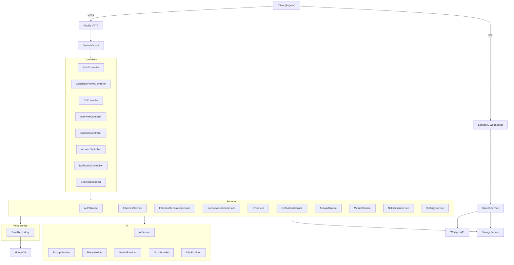

# InterviewLab

AI-powered interview preparation platform backend built with NestJS, Fastify, and MongoDB. Generates personalized interview questions from candidate profiles, captures voice answers via WebSocket streaming, and produces detailed evaluations combining deterministic speech metrics with multi-provider AI analysis.

---

## Overview

InterviewLab solves a practical problem: practicing technical and behavioral interviews with actionable, structured feedback. A candidate uploads a CV, the system extracts a structured profile via AI, then generates targeted interview questions based on that profile. Answers are captured as audio in real time through a WebSocket gateway, transcribed with Whisper, and scored across eight deterministic metrics (speaking speed, pause patterns, filler words, vocabulary richness, repetition, keyword coverage, duration, and confidence). Each answer also receives an AI-powered evaluation covering technical correctness, completeness, and communication quality. The final report aggregates per-question data into interview-level scores.

---

## Features

### Authentication & Sessions

- JWT access tokens (15-minute expiry) with refresh token rotation (7-day expiry)
- Refresh tokens are random 48-byte hex strings, SHA-256 hashed before storage
- Server-side session tracking in MongoDB with validity checks on every request
- Secure logout with session invalidation
- bcrypt password hashing (12 rounds)
- Per-route throttling on auth endpoints (10 requests / 60 seconds)

### AI Provider System

- Dynamic multi-provider architecture via NestJS dynamic modules
- **Gemini** — Google Generative AI SDK (`@google/genai`)
- **Groq** — OpenAI-compatible API with reasoning mode
- **Kimi** — Moonshot AI OpenAI-compatible API
- Provider selection configured through `AI_PROVIDER` environment variable (comma-separated, first is primary)
- Exponential backoff retry with jitter (max 3 attempts)
- Non-retryable error detection (400, 401, 403, 404)
- Request timeout handling (configurable, default 30s)
- Health check caching (5-minute TTL)
- In-memory per-user rate limiting for interview generation (10/hour)

### CV Analysis Pipeline

- PDF upload with MIME type validation and magic byte verification
- 10 MB file size limit
- Text extraction via `pdf-parse`
- AI-powered structured profile extraction (skills, technologies, experience, projects, strengths, weaknesses)
- Automatic candidate profile update upon analysis completion
- Notification on analysis completion

### Interview System

- Profile-aware AI question generation with configurable modes (HR, Technical, Mixed)
- Question count configurable from 1 to 20 per interview
- Minimum 20% profile completion required for generation
- Full interview lifecycle: Created → Ready → In Progress → Completed
- Question navigation with index tracking
- Score aggregation from per-answer AI evaluations (overall, technical, communication)
- Comprehensive reports with per-question transcripts, metrics, and AI evaluations

### Speech & Transcription

- Real-time WebSocket audio streaming (Socket.IO namespace `/speech`)
- JWT-authenticated WebSocket connections
- Chunked base64 audio upload with in-memory buffering
- Whisper API transcription on session completion
- Session constraints: max 50 concurrent sessions, 10-minute duration, 500 chunks, 1 MB per chunk
- Automatic session cleanup (every 15 minutes)
- Audio file persistence to local storage

### Deterministic Speech Metrics

Eight independent calculators producing objective per-answer measurements:

| Calculator | Metric |
|---|---|
| SpeakingSpeedCalculator | Words per minute |
| PauseCalculator | Pause count, average, longest |
| FillerCalculator | Filler word/phrase detection |
| VocabularyCalculator | Vocabulary richness score |
| RepetitionCalculator | Repetition score |
| KeywordCoverageCalculator | Target keyword coverage |
| DurationCalculator | Answer duration analysis |
| ConfidenceCalculator | Composite confidence score |

### AI Answer Evaluation

- Combines question context, candidate profile, speech metrics, and transcript
- Scores across four dimensions: technical, communication, correctness, completeness
- Identifies strengths, weaknesses, and missing concepts
- Generates follow-up questions
- Full prompt and raw response storage for auditability

### Candidate Profile

- Profile completion percentage calculated from five fields (summary, skills, technologies, experience, projects)
- CRUD operations with soft-delete support
- CV metadata integration (file URL, name, size, upload date, analysis status)

### Notifications

- Event-driven notification system (e.g., CV analysis complete)
- Read/unread tracking
- Sorted by creation date (newest first)

### User Settings

- Configurable language preference
- Notification and interview reminder toggles
- Upsert-based settings management

---

## Architecture



---

## Tech Stack

| Category | Technology |
|---|---|
| Language | TypeScript 5.4 |
| Runtime | Node.js 20 |
| Framework | NestJS 10 |
| HTTP Server | Fastify 4.28 |
| Database | MongoDB 7.0 (Mongoose 8.4) |
| Validation | class-validator + class-transformer |
| Authentication | JWT + bcrypt + refresh token rotation |
| WebSocket | Socket.IO 4.8 |
| Documentation | Swagger / OpenAI 3.0 |
| AI Providers | Gemini, Groq, Kimi |
| Speech | OpenAI Whisper API |
| PDF Parsing | pdf-parse |
| Security | @fastify/helmet, @fastify/compress, throttler |
| Testing | Jest 29 + ts-jest |
| Containerization | Docker (multi-stage build) |
| Logging | Pino (via NestJS) |

---

## Project Structure

```
backend/
├── src/
│   ├── main.ts                          # Application bootstrap
│   ├── app.module.ts                    # Root module
│   ├── app.controller.ts                # Health check endpoint
│   ├── config/
│   │   ├── configuration.ts             # Typed config (registerAs)
│   │   ├── environment.ts               # Dev environment flags
│   │   └── environment.prod.ts          # Production environment flags
│   ├── shared/
│   │   ├── enums/domain.enums.ts        # Domain enums
│   │   └── constants/app.constants.ts   # App-wide constants
│   ├── core/
│   │   ├── core.module.ts               # Global module (guards, filters, interceptors)
│   │   ├── config/auth.config.ts        # Auth configuration service
│   │   ├── models/base.model.ts         # Abstract base model
│   │   ├── repository/
│   │   │   ├── base.repository.ts       # Abstract generic repository
│   │   │   ├── query.service.ts         # Query builder with pagination
│   │   │   └── query-config.types.ts    # Query/pagination types
│   │   ├── guards/jwt-auth.guard.ts     # JWT authentication guard
│   │   ├── interceptors/
│   │   │   ├── response-wrapper.interceptor.ts
│   │   │   └── logging.interceptor.ts
│   │   ├── decorators/
│   │   │   ├── current-user.decorator.ts
│   │   │   └── check-auth.decorator.ts
│   │   └── exceptions/
│   │       ├── app.exception.ts
│   │       ├── core.errors.ts
│   │       └── global-exception.filter.ts
│   └── modules/
│       ├── auth/                        # Authentication & sessions
│       ├── users/                       # User management
│       ├── candidate-profile/           # Candidate profiles
│       ├── cv/                          # CV upload & AI analysis
│       ├── interview/                   # Interview lifecycle
│       ├── question/                    # Question management
│       ├── answer/                      # Answer submission
│       ├── ai/                          # AI provider abstraction
│       ├── metrics/                     # Speech metrics calculators
│       ├── speech/                      # WebSocket speech streaming
│       ├── storage/                     # Local file storage
│       ├── notification/                # Notification system
│       └── settings/                    # User settings
├── test/                                # E2E test configuration
├── Dockerfile                           # Multi-stage production build
├── docker-compose.yml                   # Dev environment (API + MongoDB)
├── tsconfig.json
├── nest-cli.json
└── package.json
```

---

## Authentication Flow

```
Register:
  POST /api/auth/register
  → Validate DTO (email format, password ≥ 8 chars)
  → Check email uniqueness
  → bcrypt hash (12 rounds)
  → Create User document
  → Generate refresh token (randomBytes(48).hex)
  → SHA-256 hash refresh token → store in UserSession
  → Sign JWT access token (15m expiry)
  → Return { accessToken, refreshToken }

Login:
  POST /api/auth/login
  → Find user by email
  → bcrypt compare
  → Issue token pair (same as register)

Refresh:
  POST /api/auth/refresh
  → SHA-256 hash incoming refresh token
  → Find session by hash → validate expiry + isValid
  → Invalidate old session
  → Issue new token pair (rotation)

Logout:
  POST /api/auth/logout
  → SHA-256 hash incoming refresh token
  → Find session → invalidate

Protected Routes:
  @CheckAuth() decorator
  → JwtAuthGuard extracts Bearer token
  → Verifies JWT signature + expiry
  → Validates sessionId exists in DB
  → Checks session validity + expiry
  → Attaches user to request context
```

---

## AI Architecture

The AI system uses a **strategy pattern** with dynamic module injection:

```
AIModule.forRoot()
  → Reads AI_PROVIDER env var (e.g., "gemini,groq")
  → Instantiates GeminiProvider, GroqProvider, KimiProvider
  → Binds primary provider to AI_PROVIDER injection token

AIProvider (abstract)
  ├── BaseAiProvider
  │   ├── Error mapping (HTTP status → typed errors)
  │   ├── Health check caching (5-min TTL)
  │   └── Timeout wrapper
  ├── GeminiProvider (@google/genai)
  │   └── Direct Google GenAI SDK
  └── OpenAiBaseProvider (openai SDK)
      ├── GroqProvider (api.groq.com)
      └── KimiProvider (api.moonshot.ai)

RetryService
  → Exponential backoff with jitter
  → Max 3 attempts
  → Non-retryable: 400, 401, 403, 404

PromptService
  → buildCvPrompt()         — CV analysis with JSON schema
  → buildInterviewPrompt()  — Question generation
  → buildAnswerEvaluationPrompt() — Full evaluation with metrics
  → _sanitizeUserContent()  — Truncation + backtick stripping
```

**Evaluation pipeline** (`AnswerEvaluationService`):
1. Fetch answer, question, interview, metrics, and candidate profile
2. Build evaluation prompt combining all context
3. Call AI provider with retry
4. Parse and validate JSON response
5. Persist `AiEvaluation` document

---

## API Documentation

Swagger UI is available in non-production environments at:

```
http://localhost:3000/api/docs
```

Swagger is automatically disabled when `NODE_ENV=production`. The document includes full request/response schemas for all 27 endpoints across 10 tag groups: Auth, Users, Candidate Profile, CV, Interviews, Questions, Answers, Notifications, Settings, and Health.

All endpoints are prefixed with `/api`. Request and response bodies are validated via a global `ValidationPipe` with whitelisting enabled (unknown properties are stripped and rejected).

---

## Environment Variables

| Variable | Description | Required | Default |
|---|---|---|---|
| `DATABASE_URI` | MongoDB connection string | Yes | `mongodb://localhost:27017/interviewlab` |
| `JWT_SECRET` | Secret key for JWT signing | Yes | — |
| `ACCESS_TOKEN_EXPIRES_IN` | JWT access token expiry | No | `15m` |
| `REFRESH_TOKEN_EXPIRES_IN` | Refresh token session expiry | No | `7d` |
| `HOST` | Server bind address | No | `0.0.0.0` |
| `PORT` | Server port | No | `3000` |
| `NODE_ENV` | Environment mode | No | `development` |
| `AI_PROVIDER` | Comma-separated provider list (first is primary) | No | `gemini` |
| `GEMINI_API_KEY` | Google Generative AI API key | Conditional | — |
| `GEMINI_MODEL` | Gemini model override | No | `gemini-2.5-flash` |
| `GROQ_API_KEY` | Groq API key | Conditional | — |
| `GROQ_MODEL` | Groq model override | No | `llama-3.1-8b-instant` |
| `KIMI_API_KEY` | Moonshot AI API key | Conditional | — |
| `KIMI_MODEL` | Kimi model override | No | `kimi-latest` |
| `CORS_ORIGIN` | Allowed CORS origins (comma-separated) | No | — |
| `THROTTLER_TTL` | Rate limit window in milliseconds | No | `60000` |
| `THROTTLER_LIMIT` | Max requests per window | No | `20` |

API keys are only required for providers listed in `AI_PROVIDER`.

---

## Installation

```bash
# Clone the repository
git clone https://github.com/your-username/InterviewLab.git
cd InterviewLab/backend

# Install dependencies
npm install

# Create environment file
cp .env.example .env
# Edit .env with your values (at minimum: JWT_SECRET, DATABASE_URI, and an AI provider API key)

# Start MongoDB (if running locally)
mongod --dbpath /data/db

# Start in development mode
npm run start:dev
```

The API will be available at `http://localhost:3000`. Swagger docs at `http://localhost:3000/api/docs`.

### Available Scripts

| Script | Description |
|---|---|
| `npm run start:dev` | Development mode with hot reload |
| `npm run start:debug` | Debug mode with --watch |
| `npm run build` | Compile TypeScript to `dist/` |
| `npm run start:prod` | Run compiled output |
| `npm test` | Run test suite |
| `npm run test:watch` | Run tests in watch mode |
| `npm run test:cov` | Run tests with coverage |
| `npm run test:e2e` | Run end-to-end tests |
| `npm run lint` | Lint and auto-fix |
| `npm run format` | Format with Prettier |

---

## Running with Docker

```bash
# Start API + MongoDB
docker-compose up -d

# View logs
docker-compose logs -f api

# Stop
docker-compose down
```

The `docker-compose.yml` sets up:
- **api** — NestJS app on port 3000 with hot-reload (source mounted as volume)
- **mongodb** — MongoDB 7.0 on port 27017 with persistent volume

For production builds, the multi-stage `Dockerfile` produces a minimal Alpine image running as a non-root user:

```bash
docker build -t interviewlab-api .
docker run -p 3000:3000 interviewlab-api
```

---

## Testing

The backend contains **38 test suites** across all core modules:

| Module | Suites | Coverage |
|---|---|---|
| AI | 9 | Services, providers, mappers, evaluation pipeline |
| Metrics | 10 | Services and all 8 deterministic calculators |
| Interview | 6 | Services, session, generation, scoring, reports |
| Auth | 4 | Service, password, token, JWT strategy |
| CV | 5 | Upload, analysis, PDF extraction, integration |
| Speech | 3 | Service, gateway, Whisper provider |
| Candidate Profile | 1 | Service |

Tests are unit and integration tests using `@nestjs/testing`, with mocked dependencies. The CV module includes a controller-level integration test.

```bash
npm test              # Run all tests
npm run test:cov      # Run with coverage report
npm run test:watch    # Watch mode
```

---

## Security Highlights

- **Helmet** security headers via `@fastify/helmet`
- **ValidationPipe** with whitelisting and strict mode — unknown properties are rejected
- **Refresh token hashing** — tokens are SHA-256 hashed before database storage; raw tokens are never persisted
- **Session validation** — every authenticated request verifies session existence, validity, and expiry in MongoDB
- **Ownership checks** — interview, question, answer, and profile operations validate resource ownership
- **Global rate limiting** — configurable throttler (default: 100 req / 60s), tighter limits on auth endpoints (10 req / 60s)
- **Prompt sanitization** — user-supplied content is truncated (50K chars) and backticks are stripped before AI prompts
- **File validation** — CV uploads are validated by MIME type, file size (10 MB max), and PDF magic bytes
- **Path traversal protection** — `StorageService` prevents directory traversal in file paths
- **CORS configuration** — configurable allowed origins
- **Production hardening** — Swagger disabled in production, non-root Docker user, response compression

---

## API Modules

| Module | Prefix | Description |
|---|---|---|
| **App** | `/api/health` | Health check endpoint |
| **Auth** | `/api/auth` | Registration, login, token refresh, logout, current user |
| **Users** | `/api/users` | User profile management |
| **Candidate Profile** | `/api/candidate-profile` | Profile CRUD with completion tracking |
| **CV** | `/api/cv` | PDF upload, metadata, analysis status, deletion |
| **Interview** | `/api/interviews` | Full interview lifecycle with AI question generation |
| **Question** | `/api/questions` | Question retrieval for interview sessions |
| **Answer** | `/api/interviews/:id/answers` | Voice answer submission with metrics + AI evaluation |
| **Notification** | `/api/notifications` | User notifications with read/unread tracking |
| **Settings** | `/api/settings` | User preferences (language, notifications) |
| **Speech** | `/speech` (WebSocket) | Real-time audio streaming and Whisper transcription |
| **AI** | — | Internal provider abstraction (no HTTP endpoints) |
| **Metrics** | — | Internal speech metrics calculation (no HTTP endpoints) |
| **Storage** | — | Internal file storage service (no HTTP endpoints) |

---

## Future Improvements

- Redis-backed distributed rate limiting for horizontal scaling
- Horizontal scaling for WebSocket speech sessions across multiple instances
- Metrics and observability dashboard (Prometheus + Grafana)
- Structured audit logging for AI evaluation traceability
- S3-compatible storage backend (configuration stub exists in `environment.prod.ts`)
- E2E test suite expansion
- CI/CD pipeline with automated testing and deployment
- Interview session recording and playback
- Multi-language Whisper transcription support

---

## License

UNLICENSED — This is a private project. Contact the maintainer for licensing inquiries.
